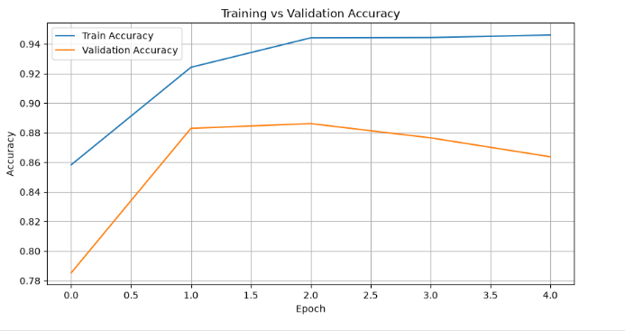
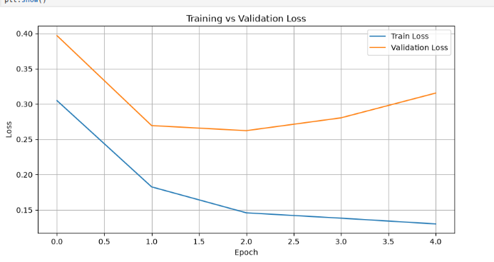
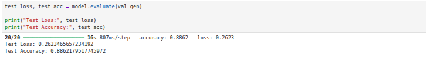

# 🩺 HealthAI - Chest X-ray Disease Detection

> Summer Internship Project | Indian Institute of Technology (IIT) Delhi

## 📌 Project Overview

This repository presents the implementation and evaluation of deep learning models for Chest X-ray disease detection, completed during my **Summer Internship at the Indian Institute of Technology (IIT) Delhi**.

The project focuses on medical image classification using Chest X-ray images. During the internship, I studied the project pipeline, configured the development environment, resolved compatibility issues, trained and evaluated the models, and documented the complete workflow.

> **Note:** This work is based on an existing open-source repository. My contribution includes environment setup, debugging, TensorFlow compatibility fixes, model training, evaluation, and documentation. I do not claim ownership of the original implementation.

---

## 🚀 Internship Highlights

- 🎓 Summer Internship at IIT Delhi
- 🧠 Deep Learning for Medical Image Analysis
- 🩻 Binary Chest X-ray Classification
- 🏥 Multi-label CheXpert Disease Classification
- ⚙️ TensorFlow/Keras Implementation
- 📈 Final Binary Classification Test Accuracy: **88.62%**

---

## 🎯 Objectives

- Understand deep learning techniques for medical image analysis.
- Implement and evaluate Chest X-ray disease detection models.
- Configure datasets and the project environment.
- Resolve TensorFlow compatibility issues.
- Train and evaluate deep learning models.
- Document the complete implementation and evaluation process.

---

## 📂 Repository Structure

```text
HealthAI-Project/
│
├── backend/
├── dashboard/
├── models/
├── notebooks/
│   ├── 01_Binary_Chest_Xray_Classification.ipynb
│   └── 02_CheXpert_Multilabel_Classification.ipynb
│
├── results/
├── screenshots/
├── requirements.txt
└── README.md
```

---

## 📊 Implemented Models

### 1. Binary Chest X-ray Classification

- **Dataset:** Chest X-ray Pneumonia Dataset
- **Task:** Binary Image Classification
- **Classes:** Normal, Pneumonia
- **Framework:** TensorFlow / Keras
- **Image Size:** 224 × 224
- **Batch Size:** 32
- **Optimizer:** Adam
- **Learning Rate:** 1e-3
- **Epochs:** 20

### Evaluation Result

| Metric | Value |
|--------|------:|
| Test Accuracy | **88.62%** |
| Test Loss | **0.2623** |

---

### 2. Multi-label Chest X-ray Classification

- **Dataset:** CheXpert (Small)
- **Task:** Multi-label Chest X-ray Disease Classification
- **Framework:** TensorFlow / Keras
- **Evaluation:** Official validation split

> **Note:** The public CheXpert (Small) dataset does not provide labeled test data. Therefore, evaluation is performed using the official validation dataset.

---

## 📈 Results

### Training Accuracy



---

### Training Loss



---

### Test Evaluation



---

## 🛠 Technologies Used

- Python
- TensorFlow
- Keras
- NumPy
- Pandas
- OpenCV
- Matplotlib
- Scikit-learn
- Jupyter Notebook
- Git
- Linux (Ubuntu)

---

## 📌 Project Status

- ✅ Binary Chest X-ray Classification – Completed
- ✅ Multi-label CheXpert Evaluation – Completed
- ✅ Repository Documentation – Completed
- ✅ Summer Internship Project – Completed

---

## ⚙️ Setup

Clone the repository:

```bash
git clone https://github.com/Chandan9574/HealthAI-Project.git
```

Move into the project directory:

```bash
cd HealthAI-Project
```

Install the required dependencies:

```bash
pip install -r requirements.txt
```

---

## 📁 Dataset

The datasets are **not included** in this repository due to their large size.

Download the required datasets separately:

- Chest X-ray Pneumonia Dataset
- CheXpert (Small)

After downloading, place them inside the `datasets/` directory before running the notebooks.

---

## 💡 Key Learnings

During this internship, I gained practical experience in:

- Deep Learning for Medical Imaging
- CNN-based Image Classification
- TensorFlow and Keras
- Model Training and Evaluation
- Medical Image Preprocessing
- Linux Development Environment
- Git and GitHub
- Debugging Machine Learning Projects
- Implementation and Evaluation of Deep Learning Models

---

## 🙏 Acknowledgements

This work was completed as part of my **Summer Internship at the Indian Institute of Technology (IIT) Delhi**.

I sincerely thank my mentor **Darakshan Rashid** and **Prof. Brejesh Lall** for their valuable guidance and continuous support throughout the internship.

The implementation is based on an existing open-source project, and all credit for the original repository belongs to its original author.

---

## 📄 License

This repository is intended for educational and research purposes.

Please refer to the `LICENSE` file for additional information.

---

## 👨‍💻 Author

**Chandan Kumar**

B.Tech, Computer Science and Engineering  
National Institute of Technology Mizoram

Summer Internship, IIT Delhi

GitHub Profile: https://github.com/Chandan9574